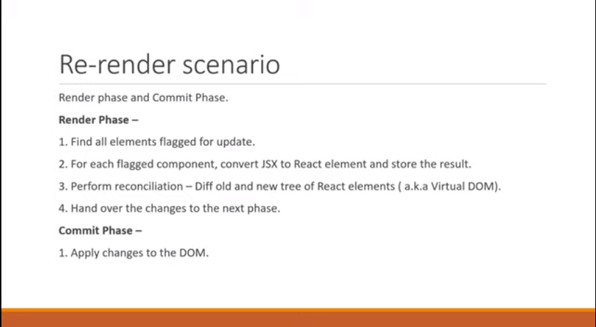
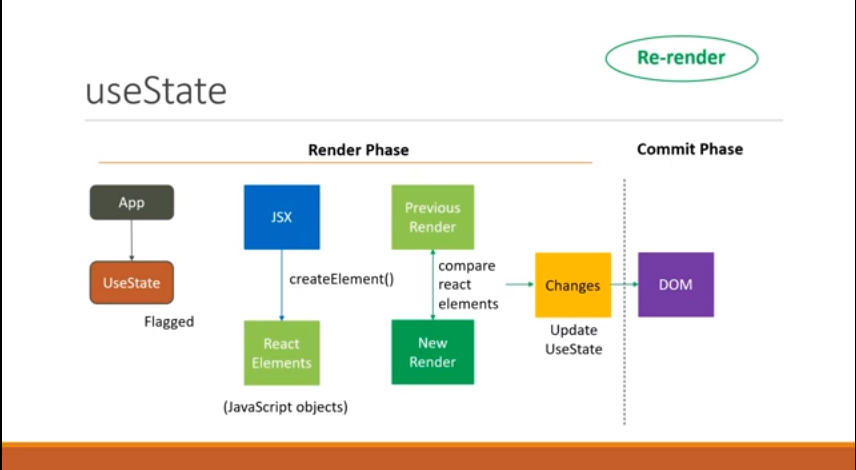
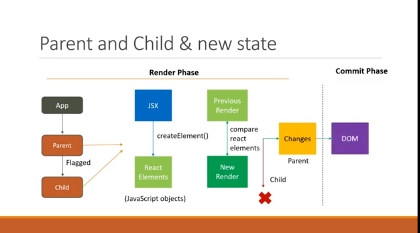
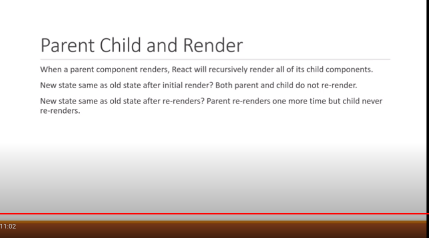
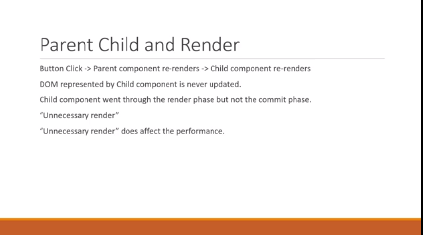
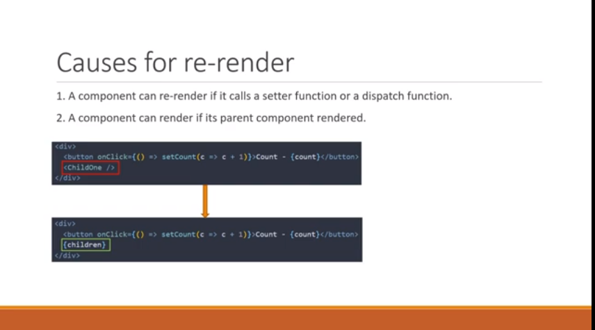
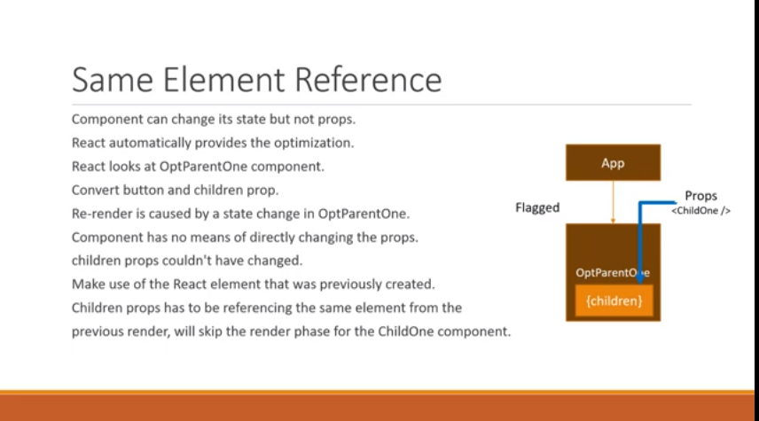
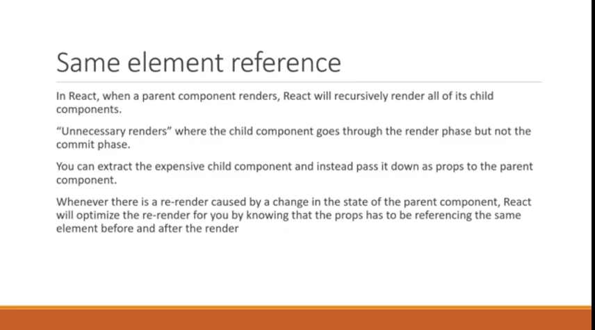
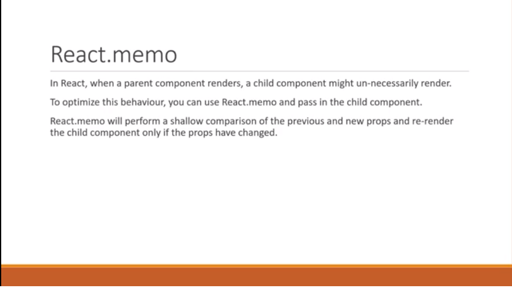

### Q What is React?

Open source front end JavaScript library, for building specially single page applications. Used for handling view layer of web and mobile apps.
Features-
Uses virtual DOM, as real DOM manuplation are expensive
Reusable components
Support for server side rendering
Unidirectional data flow

### Q What is JSX?

It is extension of JavaScript, devotes Javascript XML. We can write XML syntax in javascript. Instead of using react.creactElement, we directly write HTML element and transpiler will take care of rest.

### Q What is state in React?

State of a component is an object holding some information which might change over the lifetime of the component. We should always make state as simple as possible and minimize the no of stateful components.

### Q What is the difference between state and props?

Props are like the arguments we pass in a function, we use them to pass data from parent to child component.
Whereas state is like a variable in the function which is like a component's memory.
We can access state by child by passing it as a prop. But a parent componant cannot change state of child.
States are asynchronous, and can be modified using setstate, but we cant modify a prop and its read only.

### Q What is Strict Mode in React?

A tool that highlights potential issues in a programme
In react we use 3 input methods, prop, state and context, as read only, but when we change any of above in order to user's input, we use setstate. We should not use a variable or object while rendering component, as it might cause problems, to avoid this, react strict mode provides a solution by calling function twice during development, to help finding components breaking rules.

### Q How does React.useState know what the current state is?

Hooks relay on stable call order, hooks will always be called in the same order.
React internally stores array of state pairs and current index.

### Q Why is mutating state not recommended in React?

React compares previous state with new state, when we mutate it directly, the process gets disturbed and the outcome might be unexpected.

### Q Is mirroring a prop as a state a good thing? i.e. setting prop from a parent component to a child component as state.

No, because it only renders one time while initializing the first render.
use prop directly instead.
“Mirroring” props into state only makes sense when you want to ignore all updates for a specific prop.

### Q How do you lift state up?

If we need a sate in 2 components, we use that state in a common ancestor (parent) component, and state will flow downward. Its lifting up state.
There will be no duplicacy of state, and every state has single parent, and this is called single source of truth.

### Q What are controlled and uncontrolled components?

Component with local state called as uncontrolled, as component cannot be controlled by its parent component. They are easy to use.
But component which has state passed as prop is controlled as its controlled by parent. They are flexible

### Q What is the difference between useState and useReducer?

usestate is more readable and easy to use, require less code.
useReducer uses dispatcher and reducer function. and great if there are multiple event handlers. Better debugging, and we can check usereducer in isolation.

### Q What is Context API?

Suppose you want to provide a state to a 4th generation component, means its four level down, it will a tedious task to pass a state from up there, so what we do is create a file with react's createContext hook and wrap all the components requiring that state in provider of that context, this will pass the state to all the components we need bt just using useContext.

### Q How can you use useContext and useReducer together?

Create 2 context- state and dispatch function,
Provide context to components
use usereducer to access them

### Q What is the difference between useRef and useState?

Useref doesn't rerender, and can mutate ref.current value outside process and passed in ref attribute to point at the jsx object.

### Q What does usesEffect do?

The useEffect Hook allows you to perform side effects in your components.
The function passed to useEffect will run after the render is committed to the screen, or when a state changed on which useEffect is depended, or running cleanup function on unmounting.

### Q. Render in React

### Q. Rerendering in React

# "The commit phase is usually very fast but rendering can be slow"

## Re-render scenarios

## Q. UseState rendering || UseReducer rendering

## Q. UseState rendering with same state || UseReducer rendering with same state

## Summary for useState and rendering || UseReducer rendering

## state immutablity and rerender

## Parent & Child

## Same Element Reference

## React Memo

